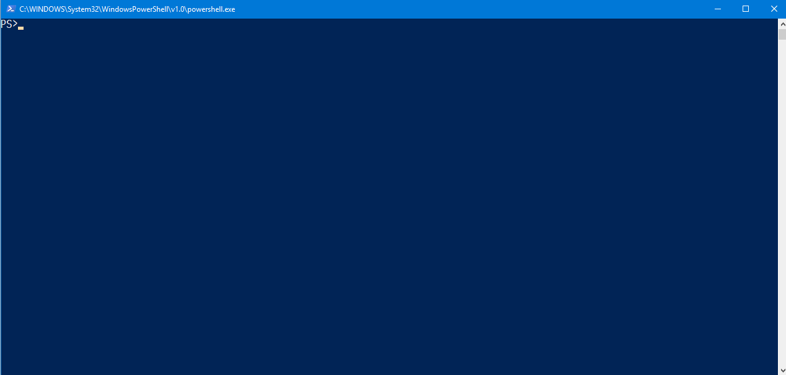

# End-to-End Test program sample with Selenium for OTP Two Factor Auth Web site. 

## Test Target Demonstration Web Site

C# on .NET Core 2.0 + ASP.NET Core 2.0 + EFCore 2.0 + SQLite

### Docker Image

You can pull the docker image of this Test Target Demonstration Web Site from bellow.

https://hub.docker.com/r/samplebyjsakamoto/otp2faauthwebappdemo/

Once you pulled this docker image,

```shell
> docker pull samplebyjsakamoto/otp2faauthwebappdemo:latest
```

You can run the demo app server by following command.

```shell
> docker run -p 52375:80 -d samplebyjsakamoto/otp2faauthwebappdemo:latest
```

## Preset Test Account

- Account Name: `foo@example.com`
- Password: `P@ssw0rd`
- Key for two factor authenticator App: `6jm7n6xwitpjooh7ihewyyzeux7aqmw2`  


## E2E Test Program

C# on .NET Core 2.0 + xUnit + Selenium



### How to configur and run test?

Once you should build the test program before configure it.

```shell
> cd OTP2FAAuthWebAppDemo.E2ETest
> dotnet build
```

After building success, `appSettings.Development.json` will generated.

Then, edit `appSettings.Development.json` and set the browser used for testing to "usingDriver" attribute.

You can choose for "usingDriver" setting from one of "Chrome", "Firefox", "Edge", and "IE".

```json
{
  ...
  "test": {
    "usingDriver": "(set using Selenium WebDriver name)", // <- Here!
   ...
  }
}
```

After save it, run the test with following command.

```shell
> dotnet xunit
```


### How to compute 2FA code?

Powered by **[Otp.NET](https://www.nuget.org/packages/Otp.NET/)** [](https://www.nuget.org/packages/Otp.NET/)

```csharp
using OtpNet;
...
var otpKeyStr = "6jm7n6xwitpjooh7ihewyyzeux7aqmw2";
var otpKeyBytes = Base32Encoding.ToBytes(otpKeyStr);
var otp = new Totp(otpKeyBytes);
var twoFactorCode = otp.ComputeTotp(); // <- got 2FA coed at this time!
```

### Appendix - Another programming language sample of computing 2FA code

- [Java](https://github.com/sample-by-jsakamoto/2fa-OTPCode-generation-demo-by-Java)

## License

[The Unlicense](LICENSE)
